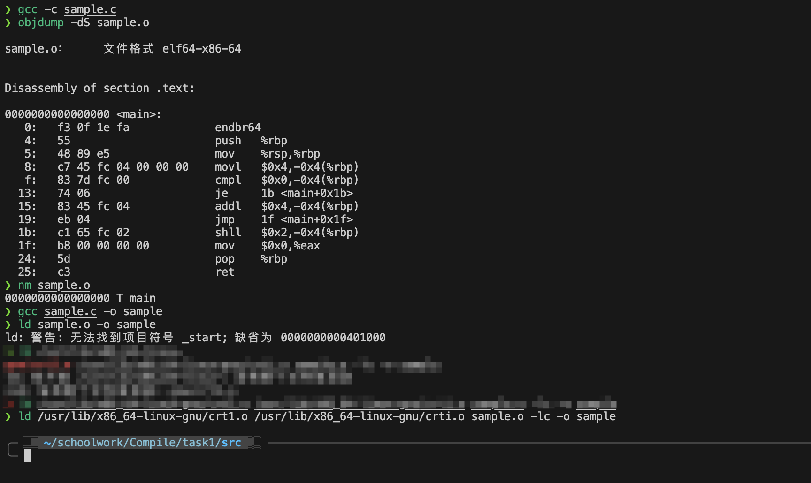
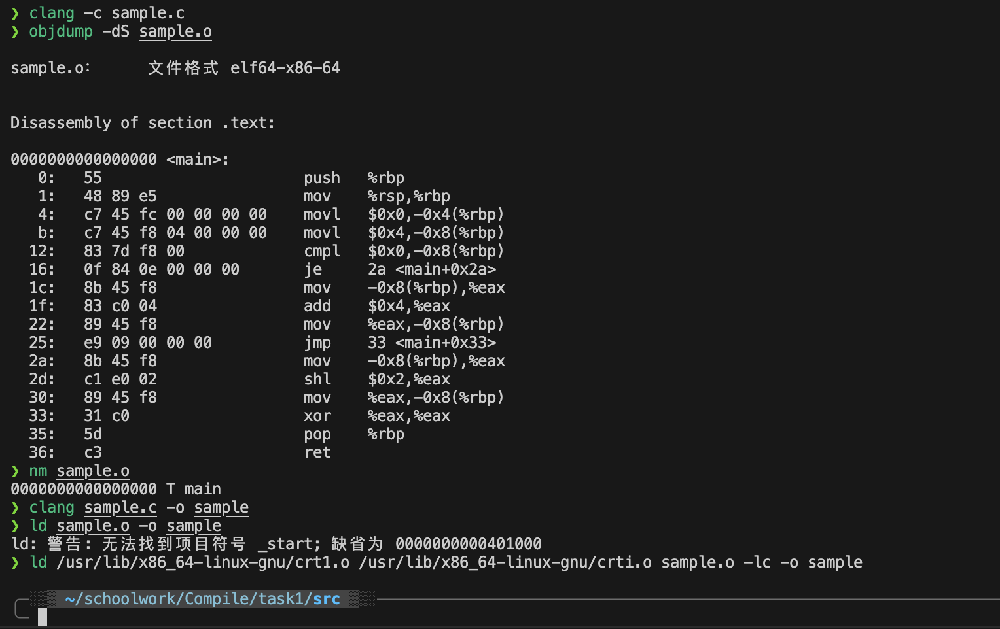

# 任务1

## 问题1-1

问题描述：如果在命令⾏下执⾏ `gcc -DNEG -E sample.c -o sample.i` ⽣成的 `sample.i` 与之前的有何区别

- `gcc -DNEG -E sample.c -o sample.i`

```c
# 1 "sample.c"
# 1 "<built-in>"
# 1 "<command-line>"
# 1 "/usr/include/stdc-predef.h" 1 3 4
# 1 "<command-line>" 2
# 1 "sample.c"

int main()
{
    int a = -4;
    if (a)
        a = a + 4;
    else
        a = a * 4;
    return 0;
}
```

- `gcc -E sample.c -o sample.i`

```c
# 1 "sample.c"
# 1 "<built-in>"
# 1 "<command-line>"
# 31 "<command-line>"
# 1 "/usr/include/stdc-predef.h" 1 3 4
# 32 "<command-line>" 2
# 1 "sample.c"

int main()
{
    int a = 4;
    if (a)
        a = a + 4;
    else
        a = a * 4;
    return 0;
}
```

解答：区别在于 `sample.i` 中的 `a = -4` 被替换为 `a = 4`

## 问题1-2

问题描述：请对⽐ `sample-32.s` 和 `sample.s` ，找出它们的区别，并上⽹检索给出产⽣这些区别的原因

- `sample-32.s`

```avrasm
    .file	"sample.c"
	.text
	.globl	main
	.type	main, @function
main:
.LFB0:
	.cfi_startproc
	endbr32
	pushl	%ebp
	.cfi_def_cfa_offset 8
	.cfi_offset 5, -8
	movl	%esp, %ebp
	.cfi_def_cfa_register 5
	subl	$16, %esp
	call	__x86.get_pc_thunk.ax
	addl	$_GLOBAL_OFFSET_TABLE_, %eax
	movl	$4, -4(%ebp)
	cmpl	$0, -4(%ebp)
	je	.L2
	addl	$4, -4(%ebp)
	jmp	.L3
.L2:
	sall	$2, -4(%ebp)
.L3:
	movl	$0, %eax
	leave
	.cfi_restore 5
	.cfi_def_cfa 4, 4
	ret
	.cfi_endproc
.LFE0:
	.size	main, .-main
	.section	.text.__x86.get_pc_thunk.ax,"axG",@progbits,__x86.get_pc_thunk.ax,comdat
	.globl	__x86.get_pc_thunk.ax
	.hidden	__x86.get_pc_thunk.ax
	.type	__x86.get_pc_thunk.ax, @function
__x86.get_pc_thunk.ax:
.LFB1:
	.cfi_startproc
	movl	(%esp), %eax
	ret
	.cfi_endproc
.LFE1:
	.ident	"GCC: (Ubuntu 9.5.0-1ubuntu1~22.04) 9.5.0"
	.section	.note.GNU-stack,"",@progbits
	.section	.note.gnu.property,"a"
	.align 4
	.long	 1f - 0f
	.long	 4f - 1f
	.long	 5
0:
	.string	 "GNU"
1:
	.align 4
	.long	 0xc0000002
	.long	 3f - 2f
2:
	.long	 0x3
3:
	.align 4
4:
```

- `sample.s`

```avrasm
	.file	"sample.c"
	.text
	.globl	main
	.type	main, @function
main:
.LFB0:
	.cfi_startproc
	endbr64
	pushq	%rbp
	.cfi_def_cfa_offset 16
	.cfi_offset 6, -16
	movq	%rsp, %rbp
	.cfi_def_cfa_register 6
	movl	$4, -4(%rbp)
	cmpl	$0, -4(%rbp)
	je	.L2
	addl	$4, -4(%rbp)
	jmp	.L3
.L2:
	sall	$2, -4(%rbp)
.L3:
	movl	$0, %eax
	popq	%rbp
	.cfi_def_cfa 7, 8
	ret
	.cfi_endproc
.LFE0:
	.size	main, .-main
	.ident	"GCC: (Ubuntu 9.5.0-1ubuntu1~22.04) 9.5.0"
	.section	.note.GNU-stack,"",@progbits
	.section	.note.gnu.property,"a"
	.align 8
	.long	 1f - 0f
	.long	 4f - 1f
	.long	 5
0:
	.string	 "GNU"
1:
	.align 8
	.long	 0xc0000002
	.long	 3f - 2f
2:
	.long	 0x3
3:
	.align 8
4:
```

解答：

1. 32位版的为 `align 4`，64位版的为 `align 8`，原因是32位版的数据对齐为4字节，64位版的数据对齐为8字节
2. 32位版的为 `pushl %ebp`，64位版的为 `pushq %rbp`，原因是32位版的使用的是32位寄存器，64位版的使用的是64位寄存器
3. 32位版的为 `esp`，64位版的为 `rsp`，原因是32位版的使用的是32位寄存器，64位版的使用的是64位寄存器
4. 32位版比64位版多了 `.section	.text.` 文本段

## 问题1-3

- 使用 `gcc` 命令 (输错的指令忽略)


- 使用 `clang` 命令


解答：两者区别在于他们生成出的汇编代码不一样，`clang` 生成的汇编代码更加长
