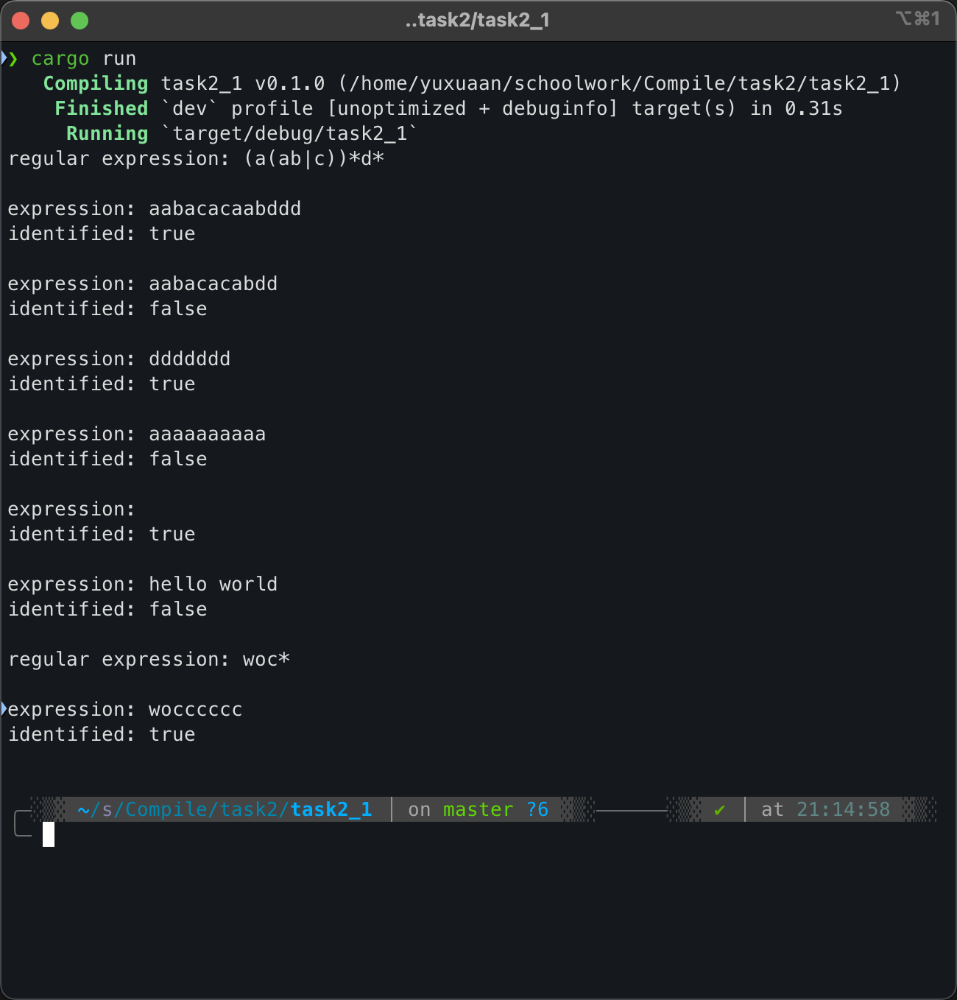
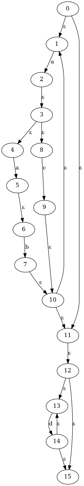

# 任务2.1

***(代码均为本人所写无任何抄袭)***

项目结构

```rust
├── answer
│   ├── NFA1.png
│   ├── QQ_1729516500586.png
│   └── QQ_1729517435878.png
├── answer.md
├── Cargo.lock
├── Cargo.toml
├── pic.drawio
├── result_pic
│   ├── nfa_1.dot
│   ├── nfa_1.png
│   ├── nfa_2.dot
│   └── nfa_2.png
└── src
    └── main.rs
```

其中 `answer.md` 和 `answer` 为本文档和文档用到的图片
`src` 目录中含rust源码，`result_pic` 目录中含有生成不同测试对应的 `NFA` 的图

## 实验目的

根据给定的正规表达式，构造相应的非确定有限自动机（NFA），并且能够判定给定字符串是否符合正规表达式的规则

## 实验内容

使用 Rust 编程语言，实现一个正规表达式的解析器，能够将正规表达式转换为非确定有限自动机（NFA），并且能够判断给定的字符串是否符合正规表达式的规则

## 设计思路

整个算法分为四个大块：**转化初始字符串**、**中缀表达式计算**、**正规表达式的基本和归纳规则**、**判断字符串是否符合正规表达式**

数据结构使用：把`NFA`看成是一个图，图的节点就是状态，边就是转移的字符

1. 转化初始字符串

    之所以不能直接把初始字符串拿来进行中缀表达式的计算，是因为中缀表达式的计算过程是一个**强符号**的过程，每一个运算符都需要**显式**的写出，而初始字符串中的连接运算符是**隐式**的，所以在这块的代码中，将隐式的连接显式(本代码中用`+`表示连接)的添加到字符串中，例如：

    ```rust
    regular expression:   (a(ab|c))*d*
    transferd expression: (a+(a+b|c))*+d*
    ```

2. 中缀表达式计算

    （符号的优先级关系：括号 > 闭包 > 连接 > 或）

    本代码中并未转化为后缀表达式，而是中缀表达式直接计算。设置两个栈，一个为`NFA`栈，一个为符号栈，整个过程中维护符号栈从底到顶优先级是严格递增的（左括号除外），具体过程如下（优先级自上而下）：

    ```rust
        1. 碰到左括号，直接入符号栈

        2. 碰到右括号，符号栈不断出栈，直到遇到左括号，将中间的符号全部出栈，利用正规表达式的归纳规则计算`NFA`，然后将`NFA`入`NFA`栈

        3. 碰到`*`，出栈一个NFA，计算闭包，然后入`NFA`栈，可以这么做的原因是，闭包是一个单目运算符，优先级是最高的，它永远可以直接进行计算；所以实际符号栈里是不可能存在`*`的

        4. 碰到`|`，符号栈不断出栈，直到当且的`|`的优先级大于符号栈顶的优先级或遇到了左括号，将中间的符号全部出栈，利用正规表达式的归纳规则计算`NFA`，然后将`NFA`入`NFA`栈

        5. 碰到连接符号`+`，符号栈不断出栈，直到遇到了左括号，将中间的符号全部出栈，利用正规表达式的归纳规则计算`NFA`，然后将`NFA`入`NFA`栈
    ```

    最后，`NFA`栈中的`NFA`就是整个正规表达式的`NFA`

3. 正规表达式的基本和归纳规则

    - 基本规则：`a`（`a`是一个字符）的`NFA`是一个有向图，有一个起始状态和一个接受状态，中间有一条边，边上的标签是`a`

    - 归纳规则：`NFA`的连接、或、闭包的计算

        - 连接：`NFA1`和`NFA2`的连接，将`NFA1`的接受状态和`NFA2`的起始状态相连，`NFA`的起始状态是`NFA1`的起始状态，`NFA`的接受状态是`NFA2`的接受状态

        - 或：`NFA1`和`NFA2`的或，新建一个起始状态和一个接受状态，将`NFA1`的起始状态和新建的起始状态相连，将`NFA2`的起始状态和新建的起始状态相连，将新建的接受状态和`NFA1`的接受状态相连，将新建的接受状态和`NFA2`的接受状态相连

        - 闭包：`NFA1`的闭包，新建一个起始状态和一个接受状态，将新建的起始状态和`NFA1`的起始状态相连，将`NFA1`的接受状态和新建的接受状态相连，将`NFA1`的接受状态和`NFA1`的起始状态相连，将新建的起始状态和新建的接受状态相连

    以上所有操作实际都是通过建图解决的，代码中默认`NFA`的起始状态是`0`号点，接受状态是图的最后一个状态点

4. 判断字符串是否符合正规表达式

    在图上跑`DFS`(深度优先搜索)，如果能够到达接受状态并且恰好字符用完，那么这个字符串就符合正规表达式，否则不符合

### 目前支持的功能

- ⽀持: 基本的正规表达式运算符，如连接（`ab`）、或（`a|b`）、闭包（`a*`）、括号（`(` `)`）

- 暂不支持: `+`（⼀次或多次重复）和 `?`（零次或⼀次），可以在构造NFA的代码中，中缀表达式的计算中添加

## 结果展示

(源码见 `/src/main.rs`)



上图测试了两个正则表达式，结果均正确，并且测试了边界条件（空集）



上图为第一个正则表达式的NFA对应的有向图，使用 `Graphviz` 工具生成

## 收获与挑战

### 坎坷的过程

- 一开始直接着手处理不经处理的字符串进行中缀表达式的计算，发现判连接符号的逻辑非常难写并且容易出错，遂想到了进行字符串的预处理操作
- NFA的归纳规则那边自己想当然的自己写了闭包的逻辑(起点向终点直接连边`ε`，终点也向起点直接连边`ε`)，导致出现了环，在后续dfs中出现死循环，而后改成了书上的写法就没问题了
- 如何可视化NFA，通过查阅资料发现了`Graphviz`工具，但目前不知道怎么横着显示，只能竖着显示

### 收获

- 通过这次实验，对正规表达式的计算有了更深的理解，对NFA的构造也有了更深的理解
- 感受到了编译原理这门学科的美妙，图论的完美运用
