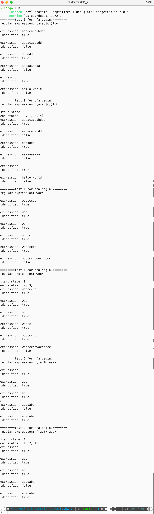
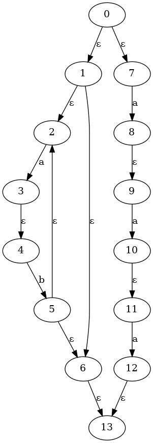
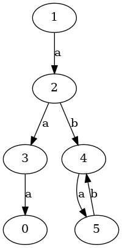

# 任务2.2

***(代码均为本人所写无任何抄袭)***

项目结构

```rust
├── answer
├── answer.md
├── Cargo.lock
├── Cargo.toml
├── result_pic
│   ├── dfa_0.dot
│   ├── dfa_0.png
│   ├── dfa_1.dot
│   ├── dfa_1.png
│   ├── dfa_2.dot
│   ├── dfa_2.png
│   ├── nfa_0.dot
│   ├── nfa_0.png
│   ├── nfa_1.dot
│   ├── nfa_1.png
│   ├── nfa_2.dot
│   └── nfa_2.png
└── src
    ├── dfa.rs
    ├── graph.rs
    ├── main.rs
    └── nfa.rs
```

其中 `answer.md` 和 `answer` 为本文档和文档用到的图片
`src` 目录中含rust源码，`result_pic` 目录中含有生成不同测试对应的 `NFA` 和 `DFA` 的图片

## 实验目的

根据给定的正规表达式，构造相应的非确定有限自动机（NFA），并且能够判定给定字符串是否符合正规表达式的规则；根据NFA构造相应的DFA，并且能够判定给定字符串是否符合正规表达式的规则

## 实验内容

使用 Rust 编程语言，实现一个正规表达式的解析器，能够将正规表达式转换为非确定有限自动机（NFA），并且能够判断给定的字符串是否符合正规表达式的规则；根据NFA构造相应的DFA，并且能够判定给定字符串是否符合正规表达式的规则

## 设计思路

鉴于上一个任务实现了NFA，本实验首先优化了项目结构，把图结构和nfa结构单令文件，本次主要在 `dfa.rs` 和 `graph.rs` 中添加代码

DFA的生成算法主要分为两大块，一是**获得DFA的所有状态(包括开始和终结状态)**(DFA设置为一个开始状态、多个终结状态)，二是**根据所得到的所有状态进行连边**，关于判定字符串问题，可以复用上份的深搜代码，只需要改动一下终结状态为一个数组即可

1. 获得DFA的所有状态

    根据NFA，首先计算出开始状态，即NFA的开始状态经过任意次 `ε` 所得到的状态集合（`ε` 闭包）；然后从这个状态开始进行 `DFS`，搜索得到所有可能到达的状态集合，这个集合就是DFA的所有状态（这个过程其实就是**子集构造法**）

2. 根据所得到的所有状态进行连边

    这一步比较简单，只需要遍历所有状态，对于每个状态，遍历所有可能的字符，得到下一个状态，然后连边即可，注意不连向空状态

### 目前支持的功能

- ⽀持: 基本的正规表达式运算符，如连接（`ab`）、或（`a|b`）、闭包（`a*`）、括号（`(` `)`），可以通过正规表达式生成NFA和DFA

- 暂不支持: `+`（⼀次或多次重复）和 `?`（零次或⼀次），可以在构造NFA的代码中，中缀表达式的计算中添加；DFA的最小化

## 结果展示

(源码见 `/src/*.rs`)







以上两个图为测试2的NFA和DFA，注意DFA的终结状态有三个，在命令行中的输出（以你自己的命令行输出为准，第一张图仅代表我的输出）会指明开始和终结状态

## 收获与挑战

### 挑战

- 目前如果NFA对应的图如果存在环，代码有可能跑不出来，DFS会陷入死循环，即使DFS在遍历边时是随机访问也很难避免，例如正规表达式 `((ab)*|aaa)*`，只是在test2中的正规表达式的末尾加上一个闭包，就会爆栈

### 收获

- 通过这次实验，对正规表达式的计算有了更深的理解，对DFA的构造也有了更深的理解
- 感受到了数据结构的实际运用的精巧
