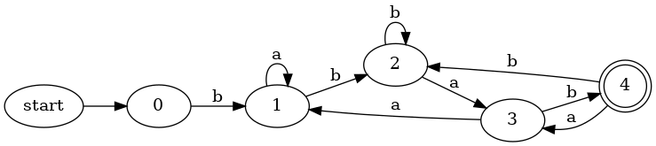

# 任务2.3

***(代码均为本人所写无任何抄袭)***

***更新：2024年10月31日，更新可视化，可以展示开始节点和接受节点；横向展示***
(ps: 前面的项目就不更新了)

项目结构

```rust
├── answer
│   └── image.png
├── answer.md
├── Cargo.lock
├── Cargo.toml
├── result_pic
│   ├── dfa_0.dot
│   ├── dfa_0.png
│   ├── dfa_1.dot
│   ├── dfa_1.png
│   ├── dfa_2.dot
│   ├── dfa_2.png
│   ├── dfa_3.dot
│   ├── dfa_3.png
│   ├── dfa_4.dot
│   ├── dfa_4.png
│   ├── dfa_5.dot
│   ├── dfa_5.png
│   ├── dfa_6.dot
│   ├── dfa_6.png
│   ├── dfa_7.dot
│   ├── dfa_7.png
│   ├── nfa_0.dot
│   ├── nfa_0.png
│   ├── nfa_1.dot
│   ├── nfa_1.png
│   ├── nfa_2.dot
│   ├── nfa_2.png
│   ├── nfa_3.dot
│   ├── nfa_3.png
│   ├── nfa_4.dot
│   ├── nfa_4.png
│   ├── nfa_5.dot
│   ├── nfa_5.png
│   ├── nfa_6.dot
│   ├── nfa_6.png
│   ├── nfa_7.dot
│   ├── nfa_7.png
│   └── whole_result.png
└── src
    ├── dfa.rs
    ├── dsu.rs
    ├── graph.rs
    ├── main.rs
    └── nfa.rs
```

其中 `answer.md` 和 `answer` 为本文档和文档用到的图片

`src` 目录中含rust源码，`result_pic` 目录中含有生成不同测试对应的 `NFA` 和 `DFA` 以及最小化后的 `DFA` 的图片

## 实验目的

根据给定的正规表达式，构造相应的非确定有限自动机（NFA），并且能够判定给定字符串是否符合正规表达式的规则；根据NFA构造相应的DFA，并且能够判定给定字符串是否符合正规表达式的规则；最后对DFA进行最小化

## 实验内容

使用 Rust 编程语言，实现一个正规表达式的解析器，能够将正规表达式转换为非确定有限自动机（NFA），并且能够判断给定的字符串是否符合正规表达式的规则；根据NFA构造相应的DFA，并且能够判定给定字符串是否符合正规表达式的规则；最后对DFA进行最小化

## 设计思路

本代码实现的方法为根据**求同法**原创设计而来，并未采用**Hopcroft算法**求异法，但本算法复杂度亦为 $O(n \log n)$，其中 $n$ 为状态数；核心数据结构为并查集和图

本算法主要分为两大块内容：**得到相同状态的集合**、**建立新图**

1. 得到相同状态的集合

    对于已经得到的DFA，遍历每一个点，得到相同状态的集合，集合中的每个点满足以下条件
     - 一致性条件：状态 `a` 和 `b` 必须同时为接受状态或非接受状态
     - 蔓延性条件：状态 `a` 和 `b` 必须有相同的转移函数，对于所有的输入符号，都必须转移到等价的状态中
    该集合使用并查集维护，此处为复杂度瓶颈 $O(n \log n)$

2. 建立新图

    对于得到的集合，将集合中的点合并为一个点，得到新的DFA，新的DFA的状态数为集合数，对于每一个集合，其转移函数为集合中任意一个点的转移函数；对于每一个集合，原来这些点是开始状态，那现在就也是开始状态，原来这些点是接受状态，那现在就也是接受状态

### 目前支持的功能

- ⽀持: 基本的正规表达式运算符，如连接（`ab`）、或（`a|b`）、闭包（`a*`）、括号（`(` `)`），可以通过正规表达式生成NFA和DFA，DFA的最小化

- 暂不支持: `+`（⼀次或多次重复）和 `?`（零次或⼀次），可以在构造NFA的代码中，中缀表达式的计算中添加；Hopcroft算法进行DFA的最小化

## 结果展示

(源码见 `/src/*.rs`)


仅以最后一个测试的结果为例(本章每一个测试点，会在命令行对应两个test编号，因为测试了DFA最小化)；某次完整测试的结果见 `result_pic/whole_result.png`




以上两个图为 `main` 函数中 `test4` 中的DFA和最小化后的DFA，开始状态和接受状态见命令行输出（以你自己的命令行输出为准，第一张图仅代表我的输出）

## 收获与挑战

### 挑战

- 在想办法维护本质相同的点的集合时，遇到了一些困难，但最终通过并查集解决了这个问题

### 收获

- 算法编程能力得到了提高
- 通过这次实验，对正规表达式的计算有了更深的理解，对DFA的构造也有了更深的理解
- 更熟练的掌握了数据结构的运用
