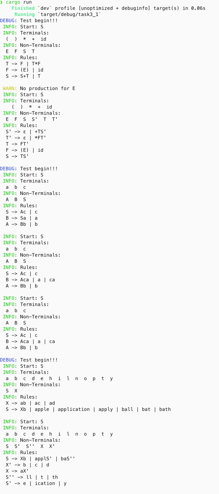
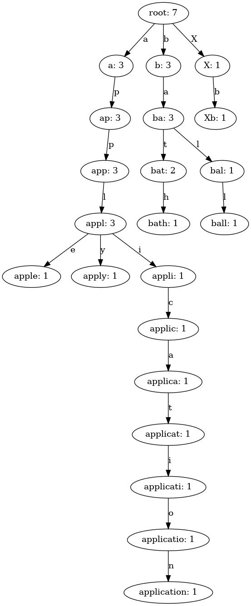
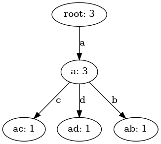

# 任务3.1 & 3.2

***(代码均为本人所写无任何抄袭)***

项目结构

```rust
.
├── 任务3.1 上下文无关文法左递归消去算法的实现_副本2.pdf
├── 任务3.2 文法左公共因子提取方法及实现_副本.pdf
├── answer.md
├── Cargo.lock
├── Cargo.toml
├── result_pic
│   ├── trie_0.dot
│   ├── trie_0.png
│   ├── trie_1.dot
│   └── trie_1.png
└── src
    ├── grammar.rs
    ├── main.rs
    ├── test.rs
    └── trie.rs
```

其中 `answer.md` 和 `answer` 为本文档和文档用到的图片

`src` 目录中含rust源码，`result_pic` 目录中含有不同测试点文法生成的 `Trie` 树

## 实验目的

1. 实现上下文无关文法的左递归消除算法（任务 `3.1`）
2. 消去上下文无关文法中直接和间接左递归（任务 `3.1`）
3. 左公共因子的提取（任务 `3.2`）

## 实验内容

使用 Rust 编程语言，实现上下文无关文法的左递归消除算法，包括直接左递归和间接左递归的消除；以及左公共因子的提取算法

## 设计思路

### 任务 `3.1`

1. 为了可拓展性以及易用性考虑，首先设计了 `Symbol` 用于表示文法中的符号，`CFG` 用于表示上下文无关文法，具体成员如下:

    ```rust
    /// Context-Free Grammar
    pub struct CFG {
        start: Symbol,                          // 开始符号
        terminals: HashSet<Symbol>,             // 终结符
        non_terminals: HashSet<Symbol>,         // 非终结符
        productions: HashMap<Symbol, Vec<Expression>>, // 产生式
    }
    ```

    其中产生式是从非终结符到若干候选式的映射，候选式的集合是一个 `Vec<Expression>`，而 `Expression` 是一个 `Vec<Symbol>`，表示一个候选式  

    本代码中为 `symbol` 也设计了一个基本库，里面包含了所有的大小写字母数字及常见符号，默认大写字母为非终结符，其余为终结符，这样就省去了在输入文法时需要人为指定终结符和非终结符的麻烦。当然，你也可以自定义终结符和非终结符，也提供了接口。并且为了进一步简化输入，只需要输入产生式的左部和右部即可，不需要输入终结符和非终结符，代码会自动识别

    ```rust
    // src/test.rs
    impl Test {
        // ...

        pub fn special_add_rule(&mut self, lhs: char, rhs: &str) {
            self.cfg.add_rule(
                &c2symbol(lhs),
                &Expression::from(vec![Symbol::from(rhs, true)]),
            );
        }

        // ...
    }
    ```

2. 首先实现消除间接左递归的算法，具体而言就是**代换**，按某种顺序依次遍历非终结符，检查其候选式的第一个 `symbol` 是否是前面出现过的非终结符，若是，则进行代换

3. 实现左递归消除算法，本质就是将形如

    ```text
    A -> Aα | β
    ```

    转化为

    ```text
    A -> βA'
    A' -> αA' | ε
    ```

### 任务 `3.2`

1. 提取左公共因子的本质其实就是识别若干候选式的共同前缀，然后将其提取出来，形成新的非终结符，然后将原来的候选式中的共同前缀去掉，替换为新的非终结符。具体实现上，为了效率，使用 `Trie` 树来存储候选式，然后遍历 `Trie` 树，遍历根节点（虚节点）下的所有子节点，进行 `DFS` 搜索，直到节点的子节点数大于 1，说明找到了共同前缀。注意，无论候选式中是否只存在终结符或者非终结符，亦或是两者都存在，都可以通过 `Trie` 树来存储，因为 `Trie` 树的节点存储的对象是 `symbol`

### 目前支持的功能

- ⽀持: 消除直接左递归和间接左递归，提取左公共因子

- TODO: 自定义终结符和非终结符中，目前功能较为一般，仅支持左式为库中非终结符，右式为单个终结符

## 结果展示





## 收获与挑战

### 挑战

- 发现 `bath` 和 `bat` 只有 `bath` 才能被接受，`bat` 直接无了，发现是在生成 `Trie` 树的时候，没有考虑节点的权值，导致 `bath` 的生成路径覆盖了 `bat` 的生成路径，导致 `bat` 无法被接受
- 在考虑如何获得前后缀的时候遇到了困难，前缀可以通过 `Trie` 树遍历点，直到有多个叶子结点说明走完了前缀；后缀怎么办呢，原本想的是直接遍历所以候选式，然后看能匹配到哪个前缀，再得到他们的后缀，但这样复杂度太高，于是想到在得到前缀的 DFS 中，顺便就继续 DFS 下去把后缀也给获得，并且绑定在它们共同的前缀上，这给编程带来了很大的便利

### 收获

- 算法编程能力得到了提高
- 通过这次实验，对文法有了更深的理解
- 更熟练的掌握了数据结构的运用
