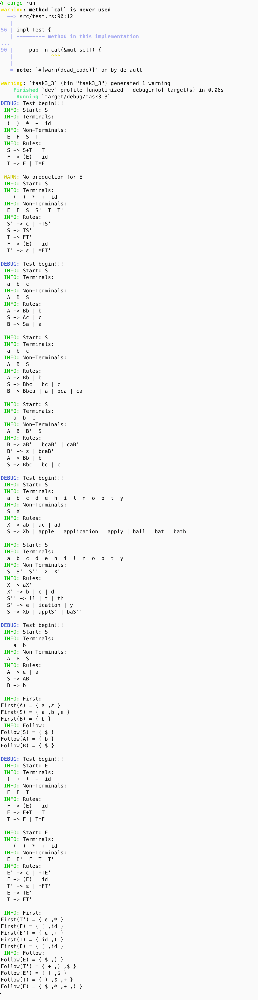

# 任务3.3

***(代码均为本人所写无任何抄袭)***

项目结构

```rust
.
├── 任务3.3 上下文无关文法FIRST集和FOLLOW集求解及实现_副本.pdf
├── answer
│   └── image.png
├── answer.md
├── Cargo.lock
├── Cargo.toml
├── result_pic
│   ├── trie_0.dot
│   ├── trie_0.png
│   ├── trie_1.dot
│   ├── trie_1.png
│   ├── trie_2.dot
│   └── trie_2.png
└── src
    ├── grammar.rs
    ├── main.rs
    ├── test.rs
    └── trie.rs
```

其中 `answer.md` 和 `answer` 为本文档和文档用到的图片

`src` 目录中含rust源码，`result_pic` 目录中含有不同测试点文法生成的 `Trie` 树

## 实验目的

1. `FIRST` 集和 `FOLLOW` 集求解

## 实验内容

使用 Rust 编程语言，实现上下文无关文法的左递归消除算法，包括直接左递归和间接左递归的消除；以及左公共因子的提取算法；求解 `FIRST` 集和 `FOLLOW` 集

## 设计思路

1. 为关于求解 `FIRST` 集，遍历所有产生式，对于每一个非终结符，如果其右侧第一个字符是终结符，则将其加入到 `FIRST` 集中，如果是非终结符，则将其 `FIRST` 集中的元素（这里有递归存在）加入到当前非终结符的 `FIRST` 集中，若该非终结符可以推出空串，则继续遍历下一个字符，重复上述操作，直到找到一个不可以推出空串的字符或者遍历完所有字符
2. 关于求解 `FOLLOW` 集，首先将开始符号的 `#` 加入到开始符号的 `FOLLOW` 集中，然后遍历所有产生式，对于每一个非终结符，如果其右侧有终结符，则将其加入到 `FOLLOW` 集中，如果其右侧有非终结符，则将其 `FIRST` 集中的元素加入到当前非终结符的 `FOLLOW` 集中，若该非终结符可以推出空串，则将其左侧非终结符的 `FOLLOW` 集中的元素加入到当前非终结符的 `FOLLOW` 集中。不断循环执行上述过程直到 `FOLLOW` 集不再变化

### 目前支持的功能

- ⽀持: 消除直接左递归和间接左递归，提取左公共因子，求解 `FIRST` 集和 `FOLLOW` 集

## 结果展示



## 收获与挑战

### 挑战

- 在实现 `FIRST` 集和 `FOLLOW` 集的时候，需要时刻注意空串的处理，否则会出现错误
- 经过老师的指点，发现其实 `FIRST` 集，更应该是一个函数，其输入参数是一个串。原设计中 `first` 的传入参数是单个字符，所以对于串的 `first` 集求解直接拿了首字符，这样存在问题，于是添加了 `first_non_empty` 函数（**是在task3_4中实现**），用于获取串中的第一个推不出空字符的符号，利用这个函数可以正确求解 `FIRST` 集

### 收获

- 算法编程能力得到了提高，要时刻注意边界条件，在本次实验中体现在了对空串的处理上
- 更熟练的掌握了数据结构的运用
