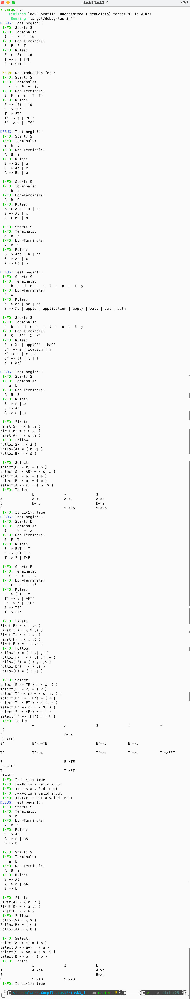

# 任务3.4

***(代码均为本人所写无任何抄袭)***

项目结构

```rust
.
├── 任务3.4 LL(1)文法判定与预测分析器设计及实现_副本.pdf
├── answer
│   └── image.png
├── answer.md
├── Cargo.lock
├── Cargo.toml
├── result_pic
│   ├── trie_0.dot
│   ├── trie_0.png
│   ├── trie_1.dot
│   ├── trie_1.png
│   ├── trie_2.dot
│   └── trie_2.png
└── src
    ├── grammar.rs
    ├── main.rs
    ├── test.rs
    └── trie.rs
```

其中 `answer.md` 和 `answer` 为本文档和文档用到的图片

`src` 目录中含rust源码，`result_pic` 目录中含有不同测试点文法生成的 `Trie` 树

## 实验目的

1. `SELECT` 集求解
2. 判断文法是否为 `LL(1)` 文法
3. 构造预测分析表
4. 实现预测分析器

## 实验内容

使用 Rust 编程语言，实现上下文无关文法的左递归消除算法，包括直接左递归和间接左递归的消除；以及左公共因子的提取算法；求解 `FIRST` 集和 `FOLLOW` 集；求解 `SELECT` 集，判断文法是否为 `LL(1)` 文法，若是，则构造预测分析表，并且实现预测分析器

## 设计思路

1. 求解 `SELECT` 集，基于上一节的 `FIRST` 集和 `FOLLOW` 集求解，`SELECT` 集的求解公式为:
   - 如果 $\alpha \overset{*}{\Rightarrow} \varepsilon$
      $$
      \space SELECT(A \to \alpha) = FOLLOW(A) \cup (FIRST(\alpha) - \{ \varepsilon \}) \\
      $$
   - 否则
      $$
      \space SELECT(A \to \alpha) = FOLLOW(A) \\
      $$
2. 判断文法是否为 `LL(1)` 文法，只需要判断文法的 `SELECT` 集是否满足 `LL(1)` 文法的定义，即对于任意两个产生式 $A \to \alpha$ 和 $A \to \beta$，有:  
   $$
   SELECT(A \to \alpha) \cap SELECT(A \to \beta) = \emptyset
   $$
3. 构造预测分析表：对于每个产生式 $A \to \alpha$，对于每个 $a \in SELECT(A \to \alpha)$，将 $A \to \alpha$ 加入到 $M[A, a]$ 中，这一步其实就是将 `SELECT` 集可视化展示
4. 实现预测分析器：通过栈和选择集来模拟语法分析的过程，逐步匹配输入字符串和语法规则，最终判断输入字符串是否符合语法，就是把书上写的伪代码实现一下

### 目前支持的功能

- ⽀持: 消除直接左递归和间接左递归，提取左公共因子，求解 `FIRST` 集和 `FOLLOW` 集，求解 `SELECT` 集，判断文法是否为 `LL(1)` 文法，若是，则构造预测分析表，并且实现预测分析器

## 结果展示



## 收获与挑战

### 挑战

- 注意一些边界条件，有可能会导致错误

### 收获

- 感谢老师对于 `first` 函数指出的问题
- 算法编程能力得到了提高，要时刻注意边界条件，在本次实验中体现在了对空串的处理上
- 更熟练的掌握了数据结构的运用
