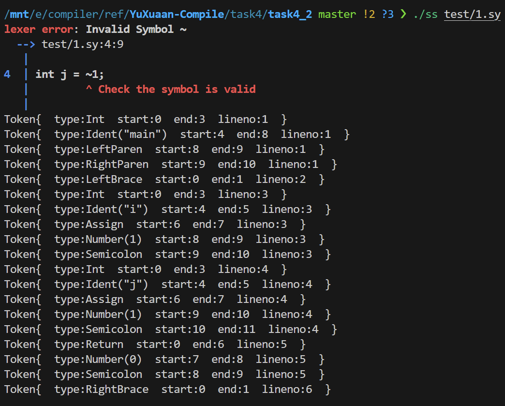
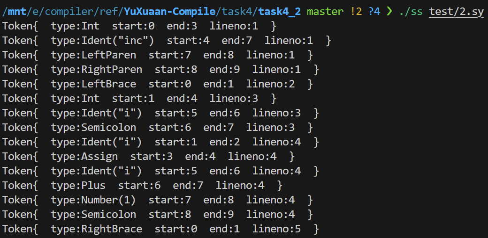
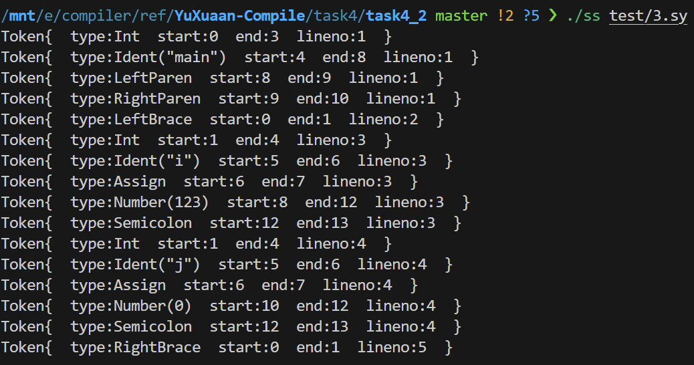
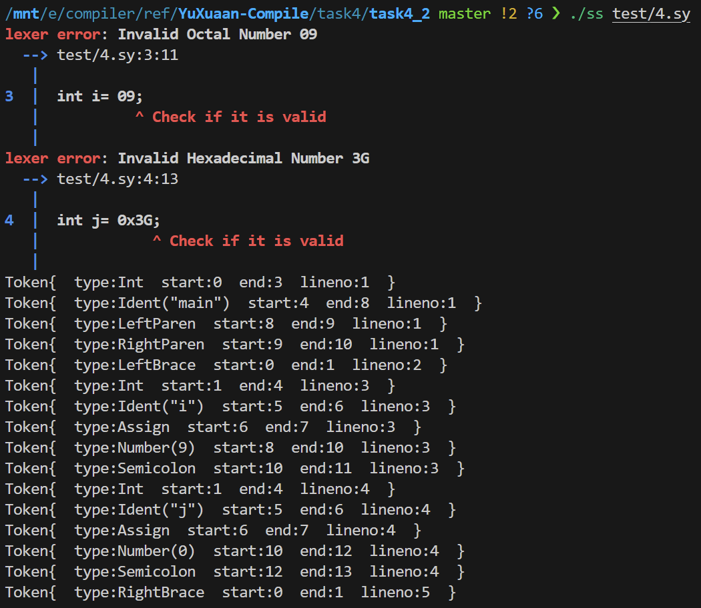

# 实验任务4.2 词法分析器设计与实现

## 实验要求

程序要能够查出SysY源代码中可能包含的词法错误:
词法错误(错误类型代码为A)：出现SysY词法中未定义的字符以及任何不符合SysY词法单元定义的字符。
程序在输出错误提示信息时，需要输出具体的错误类型、出错的位置（源程序的⾏号）以及相关的说明⽂字。

## 实验内容

### 词法分析器的构建和使用

我们的`Makefile`当中给定了ss编译器的构建过程.

使用`make ss`构建编译器时, 首先会将rust源码编译成对应的二进制文件. 为了方便使用, 我们将生成的二进制文件拷贝到了根目录下.

构建完成后, 使用`./ss file.sy`执行构建后的编译器, 并通过参数传入需要被编译的文件, 就可以执行编译器程序进行词法分析了.

```Makefile
# ./Makefile
TASK_ID = 2

ss: build
	cp target/release/task4_${TASK_ID} ss

build:
	cargo build --release

clean:
	rm -f ss
	cargo clean

.PHONY: build clean
```

### 词法分析流程

我们的词法分析过程包含以下内容:

1. 读取源代码文件

2. 根据字符类型分类, 逐一处理代码中的字符

3. 识别标识符 / 数字 / 符号 和其他语法元素，并生成对应的`Token`

4. 检测和报告词法错误, 如无效的符号或数字

5. 进行多行处理，并保留每个`Token`的位置信息, 如行号 / 起始位置等

我们的主要处理过程在`tokenize`函数当中完成. `tokenize` 函数将指定路径文件中的字符序列解析为一组语法单元`Token`, 以便后续用于语法分析或编译器处理. 它采用逐字符扫描的方式, 依据每个字符的类型生成不同的 `Token`，并处理诸如标识符、数字、符号、换行和空白字符等情况.

### 识别文件读入字符

为了进行词法检查, 首先应该对于传入的文件进行读取, 并对于输入的不同类型的字符执行各自的处理流程.

#### 文件读取过程

首先通过传入的参数, 进行`.sy`文件内容的读取, 读取文件内容并将其拆分为字符数组 `Vec<char>`, 为后续词法分析做准备, 便于将源代码拆分为各个字符进行逐一处理.

```rust
fn read_file(path: &str) -> Vec<char> {
    let code = std::fs::read_to_string(path).expect("File not found");
    code.chars().collect()
}
```

#### 字符分类

对于一个来自原始文件的字符, 我们将它分类为5类:

- `WhiteSpace`：空白字符

- `NewLine`：换行字符

- `NonDigit`：英文字符

- `Digit`：数字字符

- `NonAlpha`：暂未支持的其他字符

```rust
pub enum CharacterType {
    WhiteSpace,     // ' ','\'t'
    NewLine,        // '\n'
    NonDigit,       // 'a-z''A-Z'
    Digit,          // '0-9'
    NonAlpha(char), // unsupported
}
```

在词法分析的过程当中, 对于单个字符, 编译器会根据目前读取的进度`index`, 在相应位置读取字符, 并将字符映射为对应的`CharacterType`, 方便后续文法分析的识别过程.

```rust
fn get_character(code: &Vec<char>, index: usize) -> Option<CharacterType> {
    code.get(index).map(|c| match c {
        ' ' | '\t' => CharacterType::WhiteSpace,
        '\n' => CharacterType::NewLine,
        'a'..='z' | 'A'..='Z' | '_' => CharacterType::NonDigit,
        '0'..='9' => CharacterType::Digit,
        _ => CharacterType::NonAlpha(*c),
    })
}
```

#### 字符读入流程

在`tokenize`处理过程当中, 首先进行文件的读取及相关变量的初始化.

这里`index`表示的是当前读取进度在`code`这个一维字符数组`Vec<char>`当中的索引下标. 而`line`和`line_start`用于表示当前内容对应的文件行号, 以及当前行在文件中对应的起始`index`, 用于进行后续报错的时候进行对应的token的定位, 并不参与文件的实际读取过程.

```rust
let code = read_file(path);
let mut index = 0;
let mut line_start = 0;
let mut line = 1;
let mut tokens = Vec::new();
```

接下来, 不断地对当前`index`对应的字符进行读取, 并通过`match`进行具体的分析.

```rust
while let Some(character) = get_character(&code, index) {
    match character {
        ...
    }
}
```

### 读入字符处理

在上文当中, 我们通过分类读入字符, 实现了对于`CharacterType`的判断, 现在进行不同字符类型的具体处理.

#### `Token`结构体设计

课程设计当中要求除了进行`Token`的识别, 还需要标记出识别出错的`Token`对应的行号/列号信息, 因此`Token`结构体当中除了保存了当前词法单元的类型`TokenType`, 还保存了对应的行号和列号, 使用`line`和`token_range`进行保存.

```rust
pub struct Token {
    kind: TokenType,
    line: usize,
    range: TokenRange,
}
```

#### 空格

空格的保存非常简单, 只需要将当前的`index`自增即可

```rust
CharacterType::WhiteSpace => {
    index += 1;
}
```

#### 换行符

与空格类似, 但除了`index`, 还需要额外更新行号和当前行起始位置的信息.

```rust
CharacterType::NewLine => {
    index += 1;
    line += 1;
    line_start = index;
}
```

#### 非数字字符

由非数字字符开头的一个单词, 可能为关键字或者`Ident`标识符. 所以我们需要找到整个单词, 将单词作为整体进行`keyword`/`Ident`的判断处理. 

在这里, `find_end_of_token`传入了一个闭包, 用于表示单词是否结束的判断. 需要注意的是, `Ident`是可以携带下划线和0~9的字符的, 所以在寻找单词结束位置的过程中, 不能只进行英文字符的判断.

为了方便地在编译器内部保存各类单词, 我们在`token.rs`当中给出了所有单词的定义, 通过`from_keyword`等函数, 就可以将一段待识别的字符串转换为对应的`TokenType`了.

```rust
pub enum TokenType {
    //Literals
    Number(i32),
    Ident(String),
    ...
}
pub fn from_keyword(keyword: &str) -> Option<Self> {
    match keyword {
        "int" => Some(Self::Int),
        ...
    }
}
```

在寻找到单词整体之后, 会通过`TokenType`中的`from_keyword`函数进行关键字的识别, 按照识别结果生成对应关键字或其他标识符, 插入到`Tokens`列表当中. 最后, 将`inedx`整体偏移单词长度`len`位, 表示当前词法单元读取完成.

```rust
CharacterType::NonDigit => {
    let len = find_end_of_token(&code, index, |c| match c {
        'a'..='z' | 'A'..='Z' | '_' | '0'..='9' => true,
        _ => false,
    });
    let name = code[index..index + len].iter().collect::<String>();
    let range = TokenRange::from(index, len, line_start);
    if let Some(keyword) = TokenType::from_keyword(&name) {
        tokens.push(Token::new(keyword, line, range));
    } else {
        tokens.push(Token::new(TokenType::Ident(name), line, range));
    }
    index += len;
}
```

#### 数字字符

以数字字符开头的词法单元是一个数字字面量, 与非数字字符类似, 我们需要读取完整的数字字面量, 并进行对应的处理.

具体操作流程如下:

1. 确定数字的进制（十进制、八进制、十六进制）

2. 通过 `find_end_of_token` 找到数字的完整范围

3. 解析字符串 `number` 为具体值 `num`，并生成 `Token`

4. 验证数字是否符合进制格式。如果错误，调用 `error` 函数输出错误信息

```rust
CharacterType::Digit => {
    let base = match code.get(index..index + 2) {
        Some(&['0', 'x']) | Some(&['0', 'X']) => { index += 2; 16 }
        Some(&['0', _]) => 8,
        _ => 10,
    };
    let len = find_end_of_token(&code, index, |c| match c {
        ';' => false,
        _ => true,
    });
    let number: String = code[index..index + len].iter().collect();
    let range = TokenRange::from(index, len, line_start);
    let num = match number.parse() {
        Ok(x) => x,
        Err(_) => 0, // Wrong number set to zero
    };
    let token = Token::new(TokenType::Number(num), line, range);
    tokens.push(token);
    index += len;
    if !check_num(&number, base) {
        // output error message
    }
}
```

#### 其他字符

当检测到其他字符的时候, 还有可能是存在单/双字符运算符的可能性. 由于单字符运算符可能成为双字符运算符的前缀, 所以首先要进行双字符运算符的检测. 从读取的字符数组当中, 取出`index`对应的双字符进行判断, 假如的确检测到了双字符, 那使用类似非字符数组的处理方式. 同理, 接下来进行单字符 

如果双字符匹配都失败了, 就说明发生了词法分析错误, 需要进行错误信息的输出.

```rust
CharacterType::NonAlpha(_) => {
    // 双字符处理流程, 单字符同理
    if let Some(symbol) = code.get(index..index + 2) {
        let symbol = symbol.iter().collect::<String>();
        if let Some(symbol) = TokenType::from_double_symbol(&symbol) {
            let range = TokenRange::from(index, 2, line_start);
            tokens.push(Token::new(symbol, line, range));
            index += 2;
            continue;
        }
    }
}
```

至此, 所有类型的字符处理都完成, 词法单元的识别结果将以`Vec`形式传回.

## 样例测试

### 样例1

运行样例1, 期望输出: 该样例存在词法错误, `~`号不能被编译器正确识别.

```c
int main()
{
int i = 1;
int j = ~1;
return 0;
}
```

输出结果如下, 我们的编译器成功检测到了`~`的词法错误



### 样例2

运行样例2 期望输出: 未检测到任何词法错误

```c
int inc()
{
 int i;
 i = i+1;
}
```

运行结果如下, 确实没有检测到词法错误



### 样例3

运行样例2 期望输出: 未检测到任何词法错误

```c
int main()
{
 int i= 0123;
 int j= 0x3F;
}
```

运行结果如下, 确实没有检测到词法错误


### 样例4

运行样例4, 该程序涉及到常数的⼋进制和⼗六进制，程序需要识别出常数对应的值，并在词法单元中给予呈现. 程序应该能分别识别出⼋进制数和⼗六进制数的错误，并打印相应的错误信息.

```c
int main()
{
 int i= 09;
 int j= 0x3G;
}
```

运行结果如下, 成功识别了两个词法错误.

