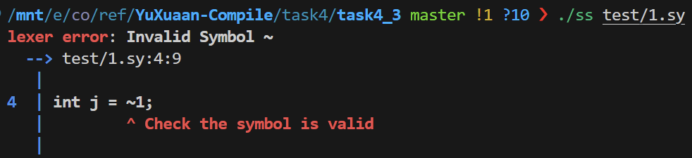
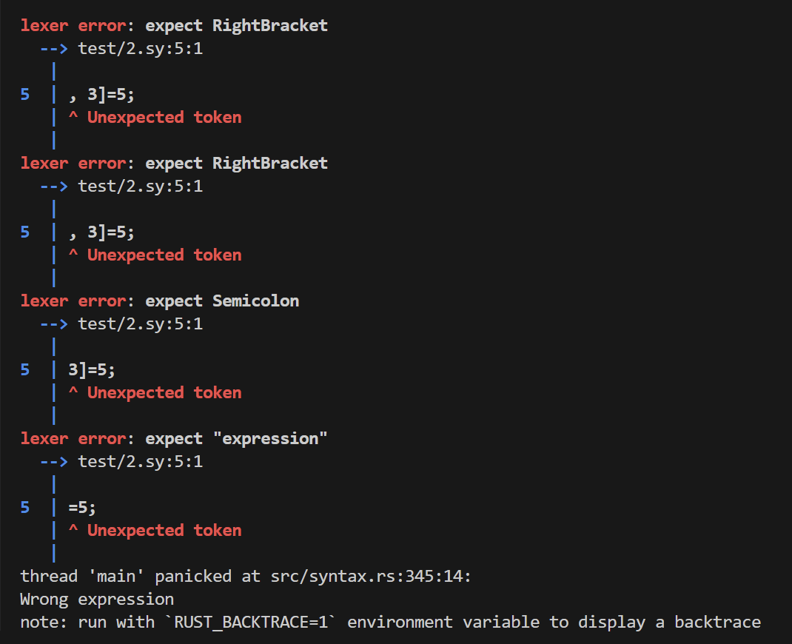
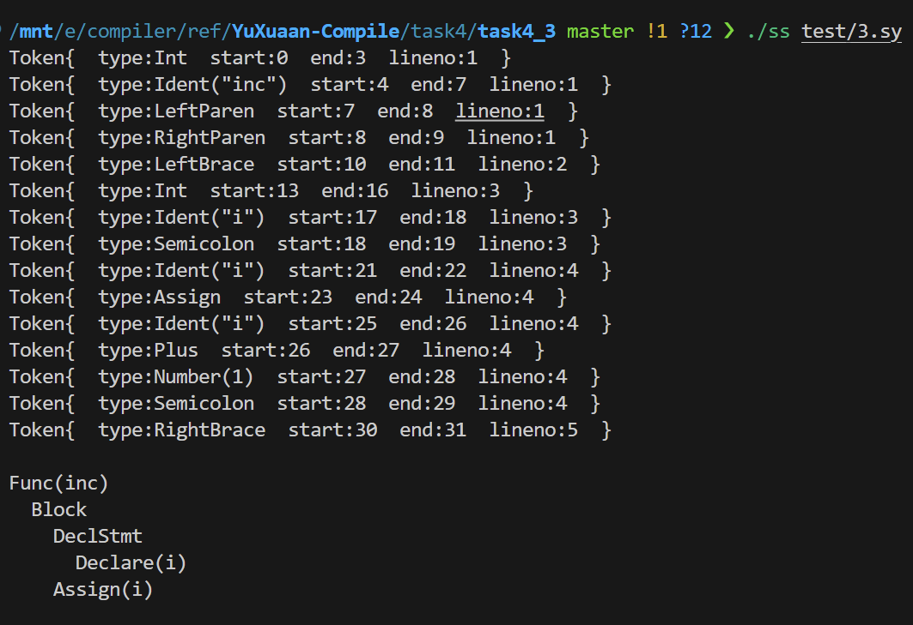
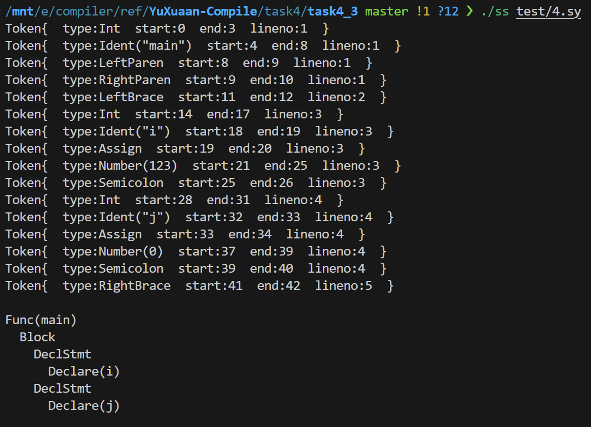
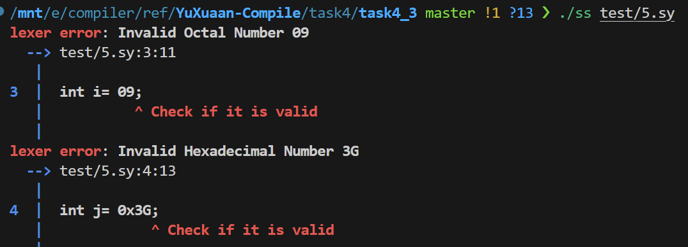

# 实验任务4.3 语法分析器设计与实现

## 实验目的

程序要能够查出SysY源代码中可能包含的词法错误和语法错误:

- 词法错误(错误类型代码为A)：出现SysY词法中未定义的字符以及任何不符合SysY词法单元定义的字符。

- 语法错误(错误类型代码为B): 程序在输出错误提示信息时，需要输出具体的错误类型、出错的位置（源程序的行号）以及相关的说明文字。

## 测试

这里运行的部分样例与4.2中样例相同, 具体期望输出不再赘述.

### 样例1

与4.2样例相同, 检测到了词法错误.

```c
int main()
{
int i = 1;
int j = ~1;
return 0;
}
```



### 样例2

输出:该程序存在两处语法错误，一是二维数组的正确访问方式是`a[5][3]`而非`a[5,3]`，二是第7行最后少了分号。

```c
int main()
{
    int a[10][12];
    int i;
    a[5, 3]=5;
    if (a[1][2]==0) 
        i=1
    else
        i=0;
}
```

可以看到, 程序确实成功地输出了两个语法错误处的错误信息.



### 样例3

期望输出: 成功进行语法分析

```c
int inc()
{
 int i;
 i = i+1;
}
```

执行结果: 语法分析成功



### 样例4

期望输出: 无语法错误.

```c
int main()
{
 int i= 0123;
 int j= 0x3F;
}
```

成功进行了语法分析



假如将`i`的初始值改为`09`, `j`的初始值改为`0x3G`, 则会发生词法分析报错.

